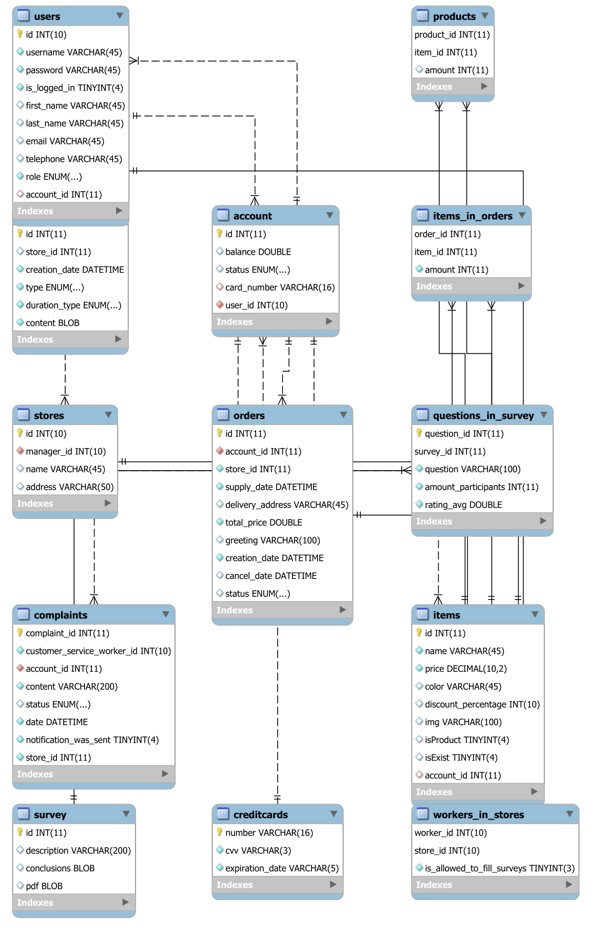
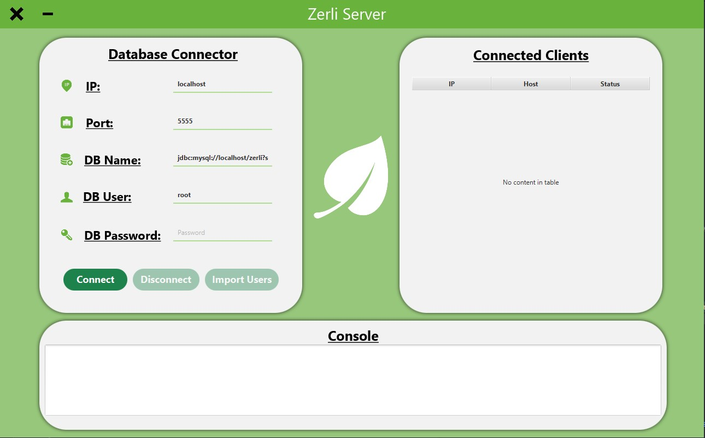
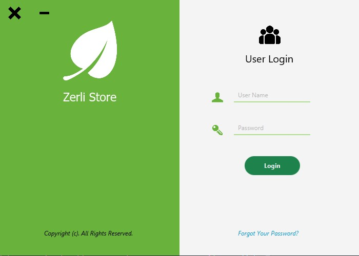
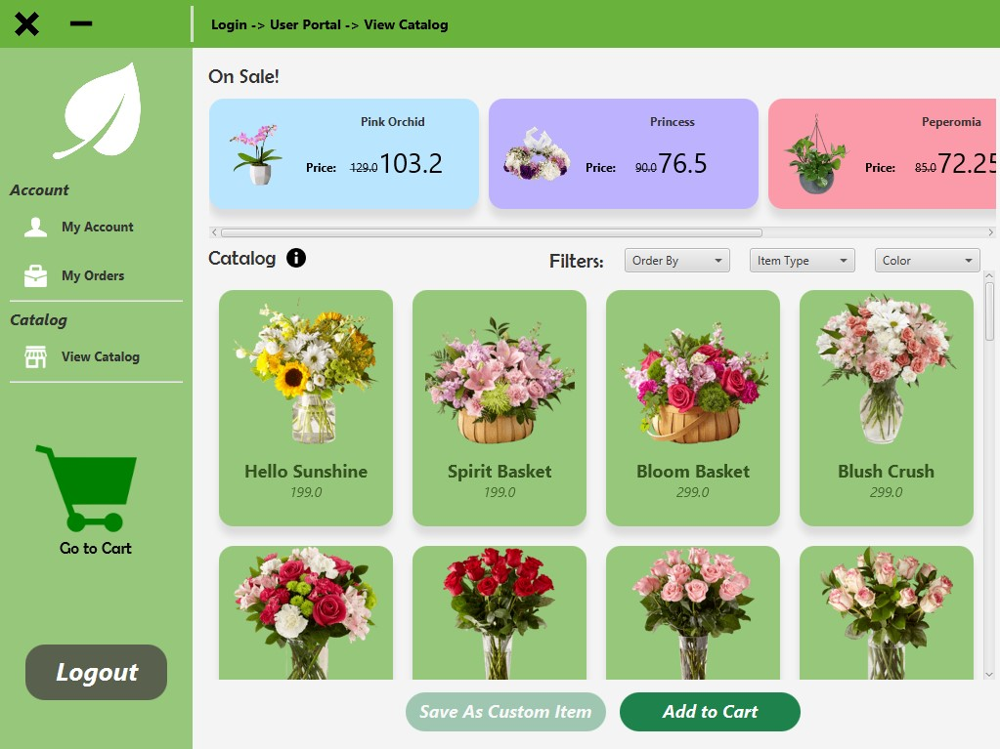
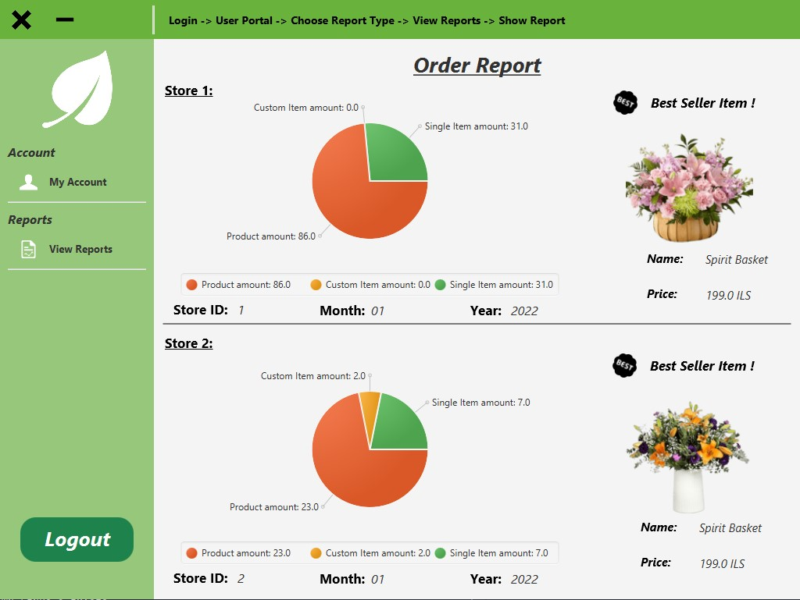

<div id="top"></div>

[![Contributors][contributors-shield]][contributors-url]
[![Forks][forks-shield]][forks-url]
[![Stargazers][stars-shield]][stars-url]
[![Issues][issues-shield]][issues-url]
[![LinkedIn][linkedin-shield]][linkedin-url]


<!-- PROJECT LOGO -->
<br />
<div align="center">
  <a href="https://github.com/OmriGawi/Flower-Chain-Management-System">
    
  </a>

<h3 align="center">Zerli - A Flower Chain Management System</h3>

  <p align="center">
    <br />
    <a href="https://github.com/OmriGawi/Flower-Chain-Management-System"><strong>Explore the docs »</strong></a>
    <br />
    <br />
    <a href="https://github.com/OmriGawi/Flower-Chain-Management-System">View Demo</a>
    ·
    <a href="https://github.com/OmriGawi/Flower-Chain-Management-System/issues">Report Bug</a>
    ·
    <a href="https://github.com/OmriGawi/Flower-Chain-Management-System/issues">Request Feature</a>
  </p>
</div>


<!-- TABLE OF CONTENTS -->
<details>
  <summary>Table of Contents</summary>
  <ol>
    <li>
      <a href="#about-the-project">About The Project</a>
      <ul>
        <li><a href="#built-with">Built With</a></li>
      </ul>
    </li>
    <li>
      <a href="#getting-started">Getting Started</a>
      <ul>
        <li><a href="#installation">Installation</a></li>
      </ul>
    </li>
    <li><a href="#usage">Usage</a></li>
    <li><a href="#contributing">Contributing</a></li>
    <li><a href="#contact">Contact</a></li>
  </ol>
</details>


<!-- ABOUT THE PROJECT -->
## About The Project
**Zerli** is a Client-Server application, multi-user, RDBMS system, used to manage a flower chain.<br/>


<p align="right">(<a href="#top">back to top</a>)</p>


### Tech Stack

* [JavaFX](https://openjfx.io/)
* [MySQL](https://www.mysql.com/)

### Environment

* [Intellij Idea](https://www.jetbrains.com/idea/)
* [MySQL Workbench 8](https://www.mysql.com/products/workbench/)
* [Gluon Scene Builder](https://gluonhq.com/products/scene-builder/)
* [JDK 11](https://www.oracle.com/java/technologies/javase/jdk11-archive-downloads.html)


<p align="right">(<a href="#top">back to top</a>)</p>


<!-- GETTING STARTED -->
## Getting Started

### Installation

1. Make sure **MySQL** is installed properly and running at port **3306** with username **'root'**
2. Clone the repository:
   ```sh
   git clone https://github.com/OmriGawi/Flower-Chain-Management-System"
   ```
3. Open **MySQL Workbench** and login to your root account

4. Create a new schema named **zerli**
5. From **Server** menu click **Data Import**<br/>
   1. Click on **Import from Self-Contained File** and navigate to <code>../Flower-Chain-Management-System/</code> and select <code>zerli_final_db.sql</code> file
   2. Select **Default Target Schema** as **zerli**
   3. Click on **Start Import**
6. Navigate to <code>../Flower-Chain-Management-System/jar/</code>
7. Open CMD/Terminal and type: <code>java -jar ZerliServer.jar</code>
8. Enter your password and click on **Connect** Button
9. Open CMD/Terminal and type: <code>java -jar ZerliClient.jar</code>
10. You're all set!
<p align="right">(<a href="#top">back to top</a>)</p>


<!-- USAGE EXAMPLES -->
## Usage
Here is a list of users with a different type of functionality:<br/>
Feel free to check any of them, they are unique!


| User Type                | Username | Password |
|--------------------------|----------|----------|
| Client                   | client   | client   |
| Company Marketing Worker | cmw      | cmw      |
| Ceo                      | ceo      | ceo      |
| Customer Service Worker  | csw      | csw      |
| Store Manager            | sm       | sm       |
| Delivery Man             | dm       | dm       |
| Store Worker             | sw       | sw       |
| Service Expert           | se       | se       |

## Functionallity
* **Client:** Create new orders
* **Company Marketing Worker:** Edit catalog, Add new items, Remove items, Enable or Disable sales.
* **Ceo:** View reports on all stores.
* **Customer Service Worker:** Add new complaints, View complaints.
* **Store Manager:** Approve & Cancel orders, View reports, Set permisions to users.
* **Delivery Man:** Confirm arrival of oders to the destination.
* **Store Worker:** Add Surveys
* **Service Expert:** Add conclusions to the surveys.

## Database Structure


**A little peek at how the project looks like, of course it contains a lot more functionality!**


**Server GUI:**
    

**Login:** <br/>
   

**Here is the catalog, also a custom item can be added by the user**
   

**Auto generated reports (Income, Orders, Complaints) each month/quarter.**<br/>
**Used Quartz-Scheduler for implementation**

   

<p align="right">(<a href="#top">back to top</a>)</p>


<!-- CONTRIBUTING -->
## Contributing

Contributions are what make the open source community such an amazing place to learn, inspire, and create. Any contributions you make are **greatly appreciated**.

If you have a suggestion that would make this better, please fork the repo and create a pull request. You can also simply open an issue with the tag "enhancement".
Don't forget to give the project a star! Thanks again!

1. Fork the Project
2. Create your Feature Branch (`git checkout -b feature/AmazingFeature`)
3. Commit your Changes (`git commit -m 'Add some AmazingFeature'`)
4. Push to the Branch (`git push origin feature/AmazingFeature`)
5. Open a Pull Request

<p align="right">(<a href="#top">back to top</a>)</p>

<!-- Collaborators -->
## Collaborators
* [Ofek Cohen](https://github.com/ofekocohen)
* [Yuval Markin](https://github.com/markinYuval)
* [Tal Cohen](https://github.com/Talco860)
* [Koral Ben David](https://github.com/koral62168)


<p align="right">(<a href="#top">back to top</a>)</p>


<!-- CONTACT -->
## Contact


Project Link: [https://github.com/OmriGawi/Flower-Chain-Management-System](https://github.com/OmriGawi/Flower-Chain-Management-System)

<p align="right">(<a href="#top">back to top</a>)</p>


<!-- MARKDOWN LINKS & IMAGES -->
<!-- https://www.markdownguide.org/basic-syntax/#reference-style-links -->
[contributors-shield]: https://img.shields.io/github/contributors/OmriGawi/Flower-Chain-Management-System.svg?style=for-the-badge
[contributors-url]: https://github.com/OmriGawi/Flower-Chain-Management-System/graphs/contributors
[forks-shield]: https://img.shields.io/github/forks/OmriGawi/Flower-Chain-Management-System.svg?style=for-the-badge
[forks-url]: https://github.com/OmriGawi/Flower-Chain-Management-System/network/members
[stars-shield]: https://img.shields.io/github/stars/OmriGawi/Flower-Chain-Management-System.svg?style=for-the-badge
[stars-url]: https://github.com/OmriGawi/Flower-Chain-Management-System/stargazers
[issues-shield]: https://img.shields.io/github/issues/OmriGawi/Flower-Chain-Management-System.svg?style=for-the-badge
[issues-url]: https://github.com/OmriGawi/Flower-Chain-Management-System/issues
[license-shield]: https://img.shields.io/github/license/OmriGawi/Flower-Chain-Management-System.svg?style=for-the-badge
[license-url]: https://github.com/OmriGawi/Flower-Chain-Management-System/blob/master/LICENSE.txt
[linkedin-shield]: https://img.shields.io/badge/-LinkedIn-black.svg?style=for-the-badge&logo=linkedin&colorB=555
[linkedin-url]: https://linkedin.com/in/omrigawi
